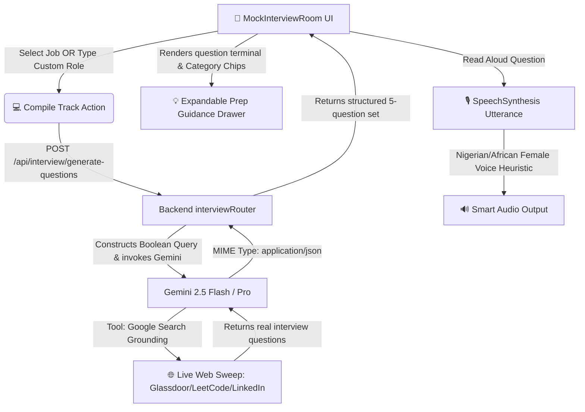

# Implementation Plan: Real-Time Google Scraped Bespoke AI Interview & Nigerian Voice Assistant

We will upgrade the GiGO Mock Interview Suite into an elite, real-time-grounded, highly interactive simulator. The AI agent will perform real-time Google search sweeps to find actual, recent interview questions on the web for any selected or typed-in target job title and company. In addition, we will implement a beautiful Nigerian/African smart female voice assistant for the "Read Aloud" question-reading system, and enrich the interface with category-level preparation guidance, keyword mapping, and rigorous scorecard feedback.

---

## 🛠️ Technical Design & Architecture



### 1. Real-Time Google Search Grounding for Questions
*   **Backend Endpoint**: `/api/interview/generate-questions`
    *   **Google Search Grounding Tool**: Add `tools: [{ googleSearch: {} }]` to the Gemini model generation configuration inside `wa-backend/src/routes/interview.ts`.
    *   **Scraping Real-Time Questions**: Update the prompt to direct Gemini to use Google Search to crawl Glassdoor, LeetCode, GitHub, corporate career pages, and LinkedIn in real time for popular and current interview questions matching the specific job title and company.
    *   **Guaranteed JSON Output**: Enforce a strict JSON array schema structure via `responseMimeType: 'application/json'` and `responseSchema` parameters inside the GenAI SDK config. This eliminates syntax parsing failures.
    *   **Custom Target Role Payload**: Accept a `customJob` object (`jobTitle`, `companyName`, `jobStyle`) from the request body to generate bespoke interview questions on-the-fly, even if the candidate hasn't loaded any discovered/matched jobs in their cockpit.

### 2. High-Converting Interactive UI Redesign (MockInterviewRoom.tsx)
*   **Dual-Option Job Input**:
    *   Provide a toggle or clean selector to choose between:
        1.  **💼 Active Matched Jobs** (dropdown of matched jobs populated from the dashboard).
        2.  **✍️ Custom Target Role** (input text fields for custom Job Title, Company, and select dropdown for Job Style: Remote, Hybrid, or On-site).
    *   This ensures "Compile Track" is fully functional and immediate, even if no matching jobs are present.
*   **Stunning Preparation & Guidance Drawer**:
    *   Render the active question's **Category** (e.g., Domain Competency, Workplace Adaptability, Behavioral, etc.) in a glowing neon badge.
    *   Add an expandable/collapsible **💡 Preparation Guidance** panel directly on the Live Question Terminal containing:
        -   **Focus Area**: Detailed recruiter expectations.
        -   **Keywords to Mention**: Interactive checklist of recommended terminology.
        -   **Communication Guide**: Actionable tone recommendations.
    *   This provides standard prep utility to candidates before they record their verbal response.

### 3. Nigerian / African Smart Female Voice Assistant
*   **Web Speech Synthesis Integration**:
    *   Query browser SpeechSynthesis voices dynamically via `window.speechSynthesis.getVoices()`.
    *   Implement an optimized voice-selection heuristic to scan, identify, and select a **Nigerian female English voice** (`en-NG`), falling back gracefully to African English (`en-ZA` / `en-GH`), standard British/US female voices (`en-GB`/`en-US`), or standard Google natural female voices depending on OS and browser support.
    *   **Acoustic Optimization**: Fine-tune the utterance parameters (`rate = 0.95` for clarity, `pitch = 1.05` for a warm, bright, professional female tone) to ensure premium auditory delivery of the compiled questions.

---

## 📂 Proposed Changes

### 1. Backend (`wa-backend`)

#### [MODIFY] [interview.ts](file:///c:/Users/iYomi/Desktop/wa-ecosystem/wa-backend/src/routes/interview.ts)
*   Import `Type` from `@google/genai`.
*   Refactor `/api/interview/generate-questions` to accept `customJob` details directly.
*   Incorporate `tools: [{ googleSearch: {} }]` and specify `responseMimeType: 'application/json'` with the structured schema.
*   Formulate a high-fidelity prompt instructing Gemini to scan the live web for actual, active interview questions related to the target job title, company, and work environment.

---

### 2. Frontend (`wa-frontend`)

#### [MODIFY] [MockInterviewRoom.tsx](file:///c:/Users/iYomi/Desktop/wa-ecosystem/wa-frontend/src/components/MockInterviewRoom.tsx)
*   Introduce state hooks for:
    -   `isCustomMode`: boolean (toggle between matched jobs or typing a custom role).
    -   `customJobTitle`, `customCompany`, `customJobStyle`.
    -   `isPrepExpanded`: boolean (for showing/hiding preparation guidance drawer).
*   Add dynamic SpeechSynthesisVoice loading and integrate the **Nigerian Female voice** preference selection heuristic in `speakQuestion`.
*   Update `generateCustomInterviewQuestions` to support compiling questions via custom typed parameters if in custom mode, passing `{ userId, customJob }` to the backend.
*   Redesign the UI with:
    -   Dual input toggle with smooth state transitions.
    -   Expanded Question Terminal displaying Category, Focus Area, Key Points, and Communication Guidance in a sleek, glassmorphic dropdown list with micro-animations.
    -   Clean layout improvements for high visual appeal.

---

## 🔬 Verification Plan

### Automated Tests
*   Compile both frontend and backend modules to verify zero lint and type errors:
    ```powershell
    cd wa-backend; npm run build
    cd ../wa-frontend; npm run build
    ```

### Manual Verification
1.  **Custom Role Selection**: Select "Type Custom Role" in the interview configurations, enter `LLM Fine-Tuning Specialist` and `Anthropic`. Click "Compile Track".
2.  **Real-Time Google Grounding**: Check server logs to verify Gemini actively triggers Google Search to fetch actual questions from the internet. Verify that 5 questions are fetched and displayed in the terminal.
3.  **Preparation Guidance Panel**: Expand the "Preparation & Guidance" drawer. Verify that the custom category, focus area, keywords, and tone recommendations are beautifully displayed.
4.  **Nigerian Smart Female Voice**: Click "Read Aloud". Verify that the voice synthesizer picks the preferred African/Nigerian female accent and speaks with the configured rate and pitch adjustments.
5.  **Scorecard Handshake**: Speak or type a custom answer and click "Analyze Answer". Confirm that Depth, Vocal, and ATS metrics are scored correctly, with keywords matched and model responses compiled.
