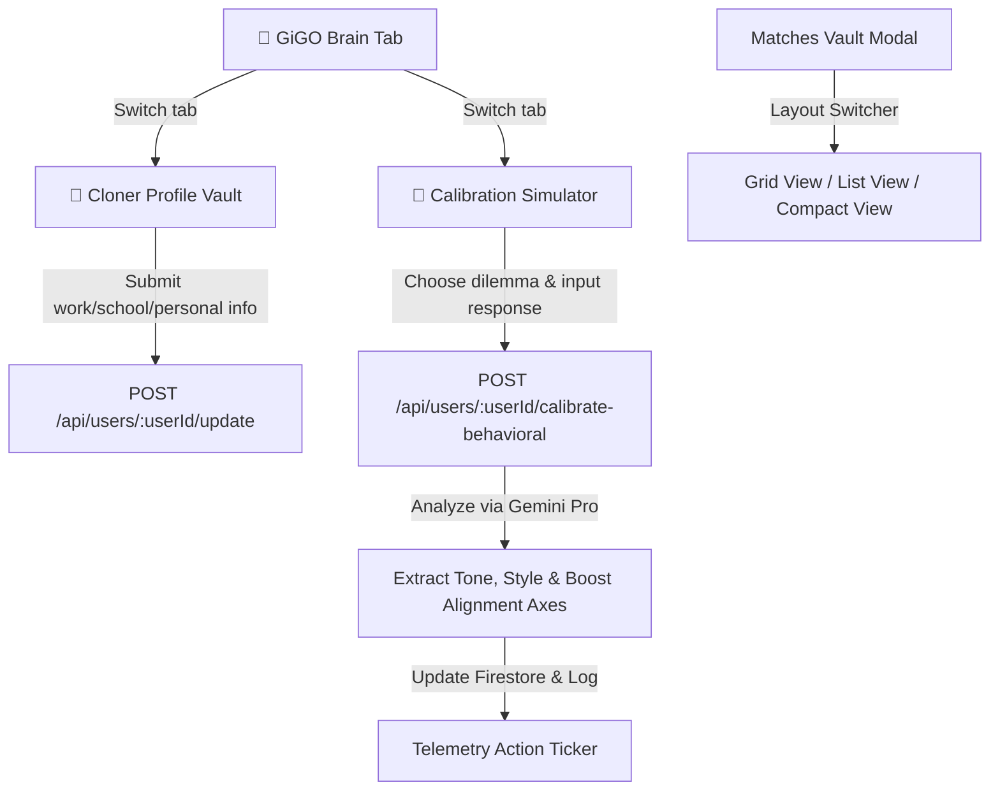

# Implementation Plan: Match Vault View Toggles & Deep Mind Cloning/Calibration Engine

We will implement:
1. **Interactive Matches Vault Layout Switcher**: A static, high-density modal allowing toggling between **Card/Grid View**, **Detailed List View**, and **Compact View**.
2. **Deep Mind Cloner Profile Vault**: A multi-section onboarding cockpit inside `🧠 GiGO Brain` to capture extensive professional, academic, personal, and behavioral details.
3. **AI Behavioral Calibration Engine & Dashboard**: Displays 4 progress axes (Cognitive Dialect, Credential Depth, Behavioral Signature, and Operational Sync) tracking user-clone fidelity. Features an interactive behavioral simulator where the clone prompts the user with dilemmas, analyzes their tone/decisions via Gemini, and calibrates alignment.

---

## 🛠️ Technical Design & Architecture



### 1. Extended Matches Vault Layout Switcher
*   **State Hook**: `vaultLayout: 'card' | 'list' | 'compact'` (persisted or in-memory React state).
*   **Header Controls**: Adds three cybernetic toggle controls in the header (e.g., `Grid ⊞`, `List ☰`, `Compact ⁝`).
*   **Interactive Styles**:
    *   **Card/Grid View**: Standard multi-column grid (`display: 'grid', gridTemplateColumns: 'repeat(auto-fill, minmax(300px, 1fr))'`).
    *   **Detailed List View**: A vertical flex list of full-width horizontal glassmorphic rows. Displays Salary and Location badge on the left, Role & Company in the middle, and Quick Apply and Details actions neatly aligned on the right.
    *   **Compact View**: An ultra-high-density micro-row table. Packs text tightly, removes heavy padding, and displays actions in miniature, allowing power users to digest 20+ matches at a single glance.

### 2. Comprehensive Mind Cloning Profiles
*   We will expand the user schema and state with the following fields:
    *   `workHistory`: Array of `{ company: string, role: string, startDate: string, endDate: string, achievements: string }`
    *   `educationList`: Array of `{ school: string, degree: string, fieldOfStudy: string, startDate: string, endDate: string }`
    *   `maritalStatus`: `'Single' | 'Married' | 'Divorced' | 'Other'`
    *   `dob`: string (Date of Birth)
    *   `address`: string (Home address)
    *   `hobbies`: string (Hobbies & Interest details)
    *   `strengths`: string (Workspace strengths)
    *   `softSkills`: string[] (Selected communication/soft skills)
    *   `teamworkExperience`: string (Experience working in teams)
    *   `conflictResolution`: string (Conflict management approach)
    *   `calibrationAxes`: `{ cognitive: number, credential: number, behavioral: number, operational: number }`
*   In the `🧠 GiGO Brain` tab, we will render a sleek segmented wizard panel containing sub-tabs to view and edit these fields. Updating them will immediately dispatch a `/update` REST API request and boost corresponding sync metrics in real-time.

### 3. AI Behavioral Mirroring & Calibration Simulator
*   **Calibration Metric Dashboard**:
    *   Calculates `cloneFidelityScore` = `(cognitive + credential + behavioral + operational) / 4`.
    *   Displays 4 neon progress meters for each axis, complete with interactive state metrics (e.g., "Cognitive Dialect: 92% calibrated", "Credential Depth: 85% mapped").
*   **Interactive Simulation Console**:
    *   Displays simulated real-world critical workplace dilemmas. For example:
        *   **Crisis Resolution SLA**: *"A fellow team member consistently misses ticket SLAs, causing backlog creep. How do you handle it?"*
        *   **Boundary Shift Dilemma**: *"An important customer requests a major project change late in the cycle. How do you respond?"*
        *   **Ambiguous Backlog**: *"You are assigned a critical ticket on a legacy system you've never touched before. What is your immediate action plan?"*
    *   Provides a speech-to-text transcriber simulator or direct text area for the user's voice/text response.
    *   Calls the backend `POST /api/users/:userId/calibrate-behavioral` endpoint.
    *   Evaluates response style using **Gemini**, returning:
        *   `toneAnalysis`: Verbal tone category (e.g., *"Empathetic & Collaborative"*, *"Highly Analytical / Objective"*, *"Direct & Operational"*).
        *   `decisionStyle`: Inferred style of decision-making (e.g., *"Systematic Diagnostic"*, *"Proactive Escalation"*, *"Consensual Alignment"*).
        *   `feedback`: Personalized advice from the clone on how it has integrated this reasoning.
        *   `boosts`: Score increases on `cognitive` and `behavioral` axes.
    *   Flashes a holographic "Mirror Sync Complete" overlay and updates the global telemetry log in Column 1.

---

## 📂 Proposed Changes

### 1. Backend (`wa-backend`)

#### [MODIFY] [index.ts](file:///c:/Users/iYomi/Desktop/wa-ecosystem/wa-backend/src/index.ts)
*   **Update Endpoint**: Enhance `/api/users/:userId/update` to capture `workHistory`, `educationList`, `maritalStatus`, `dob`, `address`, `hobbies`, `strengths`, `softSkills`, `teamworkExperience`, `conflictResolution`, `calibrationAxes`.
*   **Calibration Endpoint [NEW]**: Create `POST /api/users/:userId/calibrate-behavioral` to:
    *   Extract user dilemma answer.
    *   Use Gemini Pro with structured instructions to analyze their language, dialect, and decision parameters.
    *   Calculate customized axis boosts (+5% to +15%) based on response length and detail quality.
    *   Save updated calibration stats to Firestore.
    *   Provide rich structured telemetry results back to the client.

---

### 2. Frontend (`wa-frontend`)

#### [MODIFY] [App.tsx](file:///c:/Users/iYomi/Desktop/wa-ecosystem/wa-frontend/src/App.tsx)
*   **Layout State Hook**: Add `vaultLayout` state.
*   **Matches Vault Modal Refactor**: Add layout switcher buttons in the modal header. Refactor rendering to support `card`, `list`, and `compact` views as static, beautifully structured layout variations.
*   **Clone Profile & Calibration States**: Add state hooks for all new profile fields, cloner active sub-tabs, active calibration dilemma, and response feedback.
*   **🧠 GiGO Brain Tab Refactor**:
    *   **Calibrator Dashboard**: Display the large circular calibration ring and 4 neon progress axis meters.
    *   **Cloner Profile Vault Wizard**: Add an immersive sub-panel wizard (Tabs: Work/School, Personal, Behavioral Signature) to directly input rich profile parameters.
    *   **Calibration Simulator Console**: Render dilemma prompt cards, a response form with simulated Speech-to-Text recorder, and interactive submission handlers linking to the backend calibration endpoint.

---

## 🔬 Verification Plan

### Automated Build Checks
*   Verify that both frontend and backend compilation succeed without errors:
    ```bash
    cd wa-backend && npm run build
    cd wa-frontend && npm run build
    ```

### Manual Verification Actions
1.  **Toggle Matches Vault Layouts**: Open the matches vault. Click on `Grid`, `List`, and `Compact` toggles. Verify that layouts transform instantly between a card grid, horizontal full-width list items, and an ultra-dense list, and that all motion remains static.
2.  **Submit Cloner Profile Details**: Open `🧠 GiGO Brain` -> `Profile Vault`. Input a previous job history item and a certification. Save. Verify that the "Credential Depth" progress bar increases.
3.  **Take Calibration Test**: Open `🧠 GiGO Brain` -> `Mirror Simulator`. Read the dilemma. Enter a response. Submit. Verify that:
    -   A cybernetic calibration scanner animation runs.
    -   The backend returns a detailed cognitive analysis (Verbal Tone, Decision Style) and score boosts.
    -   The Overall Sync and axes are boosted dynamically.
    -   A beautiful, high-fidelity log statement gets dispatched to the telemetry action ticker.
