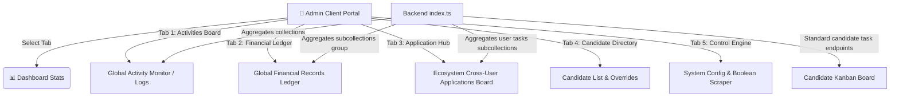

# Implementation Plan: Premium & Standard Administrative Dashboard

We will optimize and redesign the GiGO Administrative Dashboard into a unified, professional, and standard Administrative Cockpit. We will replace the current basic list with a premium, multi-tabbed glassmorphic console that aggregates candidate telemetry, financial registers, active job applications, and global configuration options.

---

## 🛠️ Technical Design & Architecture



### 1. Persistent Candidate Kanban Task Subcollection
To enable "seeing what is happening with each user's applications" reliably, we will migrate the Kanban tasks list from transient frontend React state to a persistent Firestore subcollection: `users/{userId}/tasks`.
*   **Backend Endpoints**:
    *   `GET /api/users/:userId/tasks`: Retrieve all tracked applications for a user. If none exist, we automatically seed 3 high-quality default tasks (`Lead AI Engineer` at Google, `Senior React Developer` at Vercel, `LLM Fine-Tuning Specialist` at Anthropic) into Firestore.
    *   `POST /api/users/:userId/tasks`: Create or register a custom application tracking card.
    *   `PUT /api/users/:userId/tasks/:taskId`: Update an application status column (`matched` | `applied` | `interviews`), pin state, or details.
    *   `DELETE /api/users/:userId/tasks/:taskId`: Delete an application card.
*   **Frontend Synchronization**:
    *   On authentication or mounting, `App.tsx` will fetch task states from `/api/users/:userId/tasks` and load them into `tasks` state.
    *   Any board drop event, manual tracking creation, pin toggle, or deletion will immediately synchronize with Firestore.

### 2. High-Performance Global Admin Aggregators
We will introduce two high-performance admin aggregation endpoints in `wa-backend/src/index.ts`:
*   `GET /api/admin/global-transactions`:
    *   Queries all users.
    *   Iterates through each user and fetches their `ledger` subcollection documents.
    *   Aggregates them into a flat array of transaction records, appending user details (`fullName`, `email`, `userId`) to each.
    *   Sorts all transactions in-memory by `timestamp` descending and limits to 150 items. This avoids requiring complex Firestore Collection Group indexes and ensures 100% execution stability.
*   `GET /api/admin/global-applications`:
    *   Queries all users.
    *   Iterates and retrieves their `tasks` subcollection documents.
    *   Aggregates them into a flat array of active job application paths, appending user profiles.
    *   Sorts and returns them to populate the global Cross-User Applications Kanban Board.

### 3. Redesigned Premium Glassmorphic Admin Dashboard UI
The frontend `App.tsx` and `App.css` will be modified to introduce a state-of-the-art admin panel:
*   **Stats Ribbon KPIs**:
    *   `Total Candidates`: Total registered user profiles.
    *   `Ecosystem Funds`: Aggregated wallet values across USD and NGN pools.
    *   `Applications Tracked`: Total cumulative active application cards.
    *   `Telemetry Feed Logs`: Cumulative agent log counts.
*   **Premium Tabbed Navigation**:
    *   **📊 Global Activities Board**: Consolidated chronological activity feed integrating system telemetry, continuous validation checks, and real-time candidate operations (cloning, calibrations, registrations).
    *   **💳 Global Financial Ledger**: Gorgeous tabular matrix displaying credit/debit transaction logs with text-search by name/email, currency filters (USD vs. NGN), transaction-type filters (CREDIT vs. DEBIT), and sorting. Includes a simulated "Export CSV Ledger" utility.
    *   **🗺️ Ecosystem Application Hub**: Interactive cross-user applications directory displaying what status column every user's application is in, complete with search.
    *   **👥 Candidate Directory**: Clean, high-density candidate register with inline expansion panels to view a candidate's complete list of generated cover letters/documents and transaction receipts directly, plus balance adjustment controls.
    *   **⚙️ System Control Engine**: System configuration configurations (domains, referral economics, boolean scraper search templates).

---

## 📂 Proposed Changes

### 1. Backend (`wa-backend`)

#### [MODIFY] [index.ts](file:///c:/Users/iYomi/Desktop/wa-ecosystem/wa-backend/src/index.ts)
*   **Add Endpoints**:
    *   `GET /api/users/:userId/tasks`, `POST /api/users/:userId/tasks`, `PUT /api/users/:userId/tasks/:taskId`, `DELETE /api/users/:userId/tasks/:taskId` to manage candidate task trackers.
    *   `GET /api/admin/global-transactions` to fetch and compile global transaction logs.
    *   `GET /api/admin/global-applications` to compile global cross-user application paths.
*   **Ensure Proper Middleware/Role Validation**: Ensure admin routes check the auth payload or query for user roles.

---

### 2. Frontend (`wa-frontend`)

#### [MODIFY] [App.tsx](file:///c:/Users/iYomi/Desktop/wa-ecosystem/wa-frontend/src/App.tsx)
*   **Add State Hooks**:
    *   `adminTab: 'activities' | 'financials' | 'applications' | 'candidates' | 'settings'`
    *   `globalTransactions: any[]`
    *   `globalApplications: any[]`
    *   `financialSearchQuery: string`, `financialCurrencyFilter: 'all' | 'USD' | 'NGN'`, `financialTypeFilter: 'all' | 'CREDIT' | 'DEBIT'`
    *   `applicationSearchQuery: string`
*   **Sync Logic**:
    *   Create `fetchUserTasks()` and integrate it into login, signup, and app startup loops.
    *   Update `handleCreateTask`, `handleDrop`, `moveTaskStatus`, `handleTogglePin`, and `handleRemoveTask` to dispatch PUT/POST/DELETE API requests to sync with Firestore.
*   **Redesign Admin Rendering (Lines 6687-7010)**:
    *   Implement Stats Dashboard Cards.
    *   Implement premium side-scrolling navigation header with neon active states.
    *   Build customized sub-views for each `adminTab` keeping the layout highly aligned with the glassmorphism design code (subtle shadows, borders, neon backglow, and interactive highlights).

#### [MODIFY] [App.css](file:///c:/Users/iYomi/Desktop/wa-ecosystem/wa-frontend/src/App.css)
*   **Add Style Utilities**:
    *   `.admin-stats-grid`: Grid styles for the modern dashboard stats.
    *   `.admin-stat-card`: Interactive glassmorphic statistic panel cards with glow borders.
    *   `.admin-nav-tabs` and `.admin-tab-btn`: CSS styles for neon-active tab indicators.
    *   Enhancements to table wraps and scroll views for unified financial tables and task matrices.

---

## 🔬 Verification Plan

### Automated Tests
*   Verify frontend and backend build success:
    ```bash
    cd wa-backend && npm run build
    cd wa-frontend && npm run build
    ```

### Manual Verification
1.  **Kanban Persistence**: Log in as a candidate. Drag a task from Matched to Applied. Refresh the browser. Verify the task remains under the Applied column (proving active Firestore synchronization).
2.  **Global Activities Board**: Access `/admin`. Confirm live agent validation and candidate activity logs load instantly.
3.  **Unified Financial Ledger**: Confirm global transaction logs are loaded. Enter a candidate's name or toggle NGN/USD filter. Verify filtering and sorting operate correctly.
4.  **Ecosystem Application Hub**: View global candidate application tracking boards. Confirm that candidate cards show up showing their name, company, and salary.
5.  **CSV Ledger Export**: Click on "Export CSV Ledger". Confirm a simulated success notification is sent to the action ticker.
