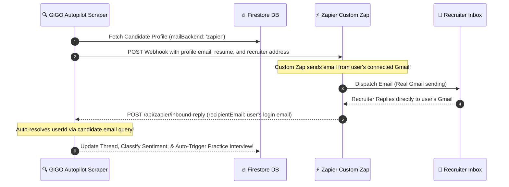

# Implementation Plan: Custom Zapier Email Automation & Inbound Thread Matching

Integrate Zapier-based email routing seamlessly into both the **on-demand application dispatcher** and the **background autopilot scraper agent**, while optimizing the inbound mail webhook to allow automatic profile resolving by email address (eliminating the need to hardcode Firestore `userId`s inside Zapier).

---

## 🎯 Architectural Overview & Closed-Loop Email Automation

With this design, **GiGO Mailroom becomes the candidate's real-world Gmail center**. They do not need to open Gmail or check their phone. All emails are sent from their real login email address via Zapier, and all recruiter replies are captured and brought directly into their GiGO cockpit.

1. **Send applications seamlessly**: When a user applies (or Autopilot applies on their behalf), GiGO POSTs the application metadata, tailored resume, cover letter, subject, and body to the user's **Zapier Catch Webhook URL**, capturing their registered login email as the sender key.
2. **Real Gmail Dispatch**: Zapier triggers and dispatches the email using the user's connected Gmail/SMTP account. The email is sent from the user's actual email address.
3. **Automated Recruiter Tracking**: Recruiter replies arrive in the user's real email inbox.
4. **Instant Sync & AI Cockpit Trigger**: Zapier catches the reply and routes it to `/api/zapier/inbound-reply`. The backend resolves the candidate's profile by their email address, syncs the email thread inside Firestore, classifies recruiter sentiment, and automatically unlocks tailored Mock Interview practice prep!

---

## 📂 Proposed Changes

We will execute changes in a highly cohesive, non-breaking manner across the backend.

### 1. Backend: Autopilot Agent
#### [MODIFY] [scraper-agent.ts](file:///c:/Users/iYomi/Desktop/wa-ecosystem/gigo-backend/src/scraper-agent.ts)
- Add complete support for `mailBackend === 'zapier'`.
- Retrieve `userData.zapierWebhookUrl` or fall back to system defaults.
- Issue an `axios.post` request dispatching high-fidelity email payloads (including tailored CV, cover letter, recruiter parameters, and candidate meta-variables) directly to the catch webhook.
- Update internal state logging outputs to register successful Zapier autopilot dispatch.

### 2. Backend: Inbound Mailroom Webhook
#### [MODIFY] [mailroom.ts](file:///c:/Users/iYomi/Desktop/wa-ecosystem/gigo-backend/src/routes/mailroom.ts)
- Refactor `POST /api/zapier/inbound-reply` to support **dynamic candidate lookup**.
- If `userId` is missing, the endpoint will query the Firestore `users` collection by the `recipientEmail` field (which represents the candidate's personal email).
- This allows standard Zapier "New Email" triggers on Gmail/IMAP/Office365 to instantly route back recruiter replies to GiGO with zero customization or hardcoded account IDs.

---

## 🔬 Verification Plan

We will perform comprehensive verification steps to ensure type-safety, correctness, and compilation excellence.

### Automated Tests
- Run `npm run build` inside `gigo-backend` to ensure 100% typescript compliance and zero compilation errors.
- Run a simulation script to verify that the email-based user lookup is functioning as expected in Firestore.

### Manual Verification
1. Setup a mock Zapier payload and submit a POST request to our `/api/zapier/inbound-reply` webhook using a simulated recruiter reply.
2. Confirm the mailroom thread updates, classifies the sentiment, and triggers practice interview prep sessions successfully if the recruiter offers an interview.
