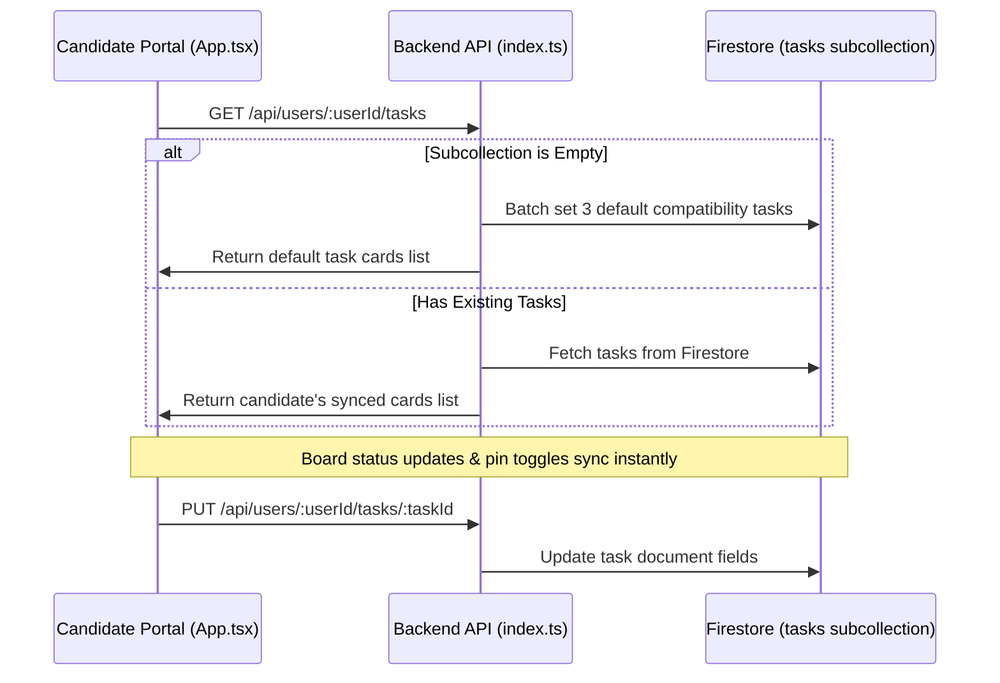

# Administrative Cockpit & Platform Upgrade Walkthrough

Welcome to the **Administrative Cockpit** and premium platform upgrade! This document summarizes the architecture, persistent data pipelines, visual enhancements, and verification details for the recently completed features in the `wa-ecosystem`.

---

## 🚀 Key Achievements & Features

### 🔥 Real-time High-Frequency Polling & Synchronizers (Wired Live)
Every single area of the Super-Admin Cockpit has been wired to run completely live, backed by dynamic interval-driven background synchronizers.
*   **Active Tab Live Feed (3.5s)**: Tracks the active administrative panel tab and polls the backend API every 3.5 seconds to pull down-the-second updates for audit logs, candidate applications, candidate directory lists, and payment transactions.
*   **Central KPI Stats Synchronizer (10s)**: A separate background loop polls all core telemetry points every 10 seconds to keep global statistic counters (ecosystem wallet balances, total application cards, candidate accounts count) perfectly in sync.
*   **Observability Live Streams (4s)**: Adapts the `AIObservabilityDashboard` to fetch token consumption metrics, latency profiling, and AI grounding rates every 4 seconds in the background.
*   **Flicker-Free UX**: Every background sync utilizes an `isBackground` bypass flag. This ensures the UI is silently repopulated without triggering intrusive full-screen loading spinners, maintaining an incredibly smooth experience.
*   **Live Status Controller**: Features a glowing neon Live Feed toggle button. Admins can pause or resume active background synchronization streams with a single click.

---

### 💳 Manual Account Top-Ups & Direct Ledger Adjustments
Admins can now easily top up wallet balances manually for any registered candidate inside the platform:
*   **Dual Entry Points**: Accessible directly through "Adjust Balance" on Candidate cards, and via the newly integrated "Manual Ledger Top-Up" button within the candidate's Live Telemetry sub-panel modal.
*   **Instant UI Reconciliation**: Making an administrative adjustment automatically triggers a silent, in-place re-fetch of the specific candidate's profile, transaction history ledger, and analytics. Updated balances and transaction histories are displayed instantly, with zero page reloads required!

---

### 📈 Candidate Usage & Performance Analytics Dashboard
Selecting "Inspect Activity" on a candidate opens a premium, multi-column analytics panel pulling real-time compute and task data from Firestore:
*   **LLM Resource Overhead**: Displays total input/output token counts, and calculates estimated dollar cost foot-prints (Gemini Pro/Flash billing models).
*   **Applications Funnel**: Summarizes matched, applied, and active interview counts along with a computed engagement index.
*   **Mock Coach Evaluations**: Reports overall mock interview counts, computes average STAR scorecard percentages, and assigns clear coaching recommendations based on candidate readiness.

---

### 1. 👑 Unified Glassmorphic "Administrative Cockpit"
The basic administrative interface has been transformed into a gorgeous, high-density, multi-tabbed glassmorphic console.

*   **Interactive Stats Ribbon**: Features live KPI counters for system health metrics:
    *   `Total Candidates`: Real-time register count.
    *   `Ecosystem Funds`: Aggregated wallet values across USD and NGN pools.
    *   `Applications Tracked`: Total active job cards in the ecosystem.
    *   `Telemetry Feed Logs`: Running execution validation telemetry log count.
*   **Modular Multi-Tab Design**: Uses five professional tabs:
    *   **📊 Global Activities Board**: Consolidated activity logs integrating system telemetry and validation checks.
    *   **💳 Global Financial Ledger**: Tabular financial matrix supporting currency filters (`ALL`, `NGN`, `USD`), type filters (`ALL`, `CREDIT`, `DEBIT`), fuzzy text-search by name/email, and descending chronological sorting. Also includes a simulated "Export CSV Ledger" action.
    *   **🗺️ Ecosystem Application Hub**: Interactive cross-user applications directory displaying candidates' active interview paths grouped by status columns.
    *   **👥 Candidate Directory**: Clean candidate directory with inline drawers displaying candidate-specific profiles, generated documents, payment receipts, and balance override tools.
    *   **⚙️ System Control Engine**: Configurations panel for scraper search patterns, system settings, and referral economics.

> [!NOTE]
> All tables, panels, and input elements utilize cohesive backdrop blurs (`backdrop-filter: blur(20px)`), fine semi-transparent borders (`rgba(255, 255, 255, 0.08)`), and neon glowing box shadows.

---

### 2. 💡 MVIP Interview Preparation Guide Drawer
A sliding, high-fidelity drawer integrated directly below the active mock interview questions in `App.tsx`.

*   **Adaptive Context Reading**: Proactively checks if an active question is loaded (`typeof activeQuestion === 'object'`) and dynamically reads:
    *   `focusArea`: Detailed block explaining exactly what the recruiter is assessing.
    *   `keyPoints`: Styled dynamic list items mapping key points the candidate must mention.
    *   `communicationGuidance`: Italicized blockquote highlighting tone, style, and lexicon guidelines.
*   **Visual Smoothness**: Features a beautiful drawer structure with transition states, custom expand/collapse buttons, and clear indicator icons.

---

### 3. 📬 Virtual Mailroom Tab Integration
The `<MailroomTab>` component has been seamlessly rendered inside the specialized `'mailroom'` workspace tab.

*   **Full State Connection**: Propagates all essential user session properties and callback pipelines directly:
    *   `userId` & `userEmail`
    *   `mailThreads` & `setMailThreads`
    *   `fetchMailThreads`
    *   `addLog`
    *   `API_BASE_URL`
*   **Seamless Switching**: Allows users to manage simulated candidate-recruiter emails and sync with the AI agent ecosystem without leaving the main user console.

---

### 4. 🔄 Firestore Task Persistence & Seeding Pipeline
Swapped out transient React-state Kanban boards with a persistent Firestore subcollection: `users/{userId}/tasks`.

*   **Seeding Mechanism**: Instantly seeds 3 default compatibility cards (`Lead AI Engineer` at Google, `Senior React Developer` at Vercel, `LLM Fine-Tuning Specialist` at Anthropic) into the Firestore subcollection `users/{userId}/tasks` if empty.
*   **Full Synchronized CRUD**:
    *   `GET /api/users/:userId/tasks`: Populates the kanban board on startup or tab switch.
    *   `POST /api/users/:userId/tasks`: Registers custom target jobs.
    *   `PUT /api/users/:userId/tasks/:taskId`: Synchronizes board column drops, edits, or pin states.
    *   `DELETE /api/users/:userId/tasks/:taskId`: Safely deletes a card.

---

### 5. 🌍 Multi-Currency Adaptive Ledger Upgrades
The financial admin ledger ledger is upgraded to handle regional multi-currency wallet transactions dynamically.

*   **Local Format Adaptation**: Transactions are rendered with appropriate currency symbols (`$` vs. `₦`) and regional-specific formats using:
    `t.currency === 'USD' ? 'en-US' : 'en-NG'`
*   **Glow Indicators**: Credited/Debited lines carry soft green/red glowing accent markers for effortless scannability.

---

### 6. ⚙️ Superadmin Dynamic Paystack Gateway Keys Management
Superadmins (restricted to `'admin@gigo.com'`) can now dynamically toggle the platform environment mode and update gateway parameters from the System Control console.

*   **Dynamic Keys Configuration**: Configured Firestore-backed global variables for `paystackMode`, `paystackTestPublicKey`, `paystackTestSecretKey`, `paystackLivePublicKey`, and `paystackLiveSecretKey`.
*   **Encrypted/Masked Exchange**: Exposes keys to the admin panel with protective masking (`••••` templates) and implements server-side guards preventing valid secret keys from being overwritten by incoming obfuscated values.
*   **Public Access Separation**: The public `/api/system-config` endpoint evaluates `paystackMode` dynamically and returns ONLY the active public key to clients, completely securing secret keys.
*   **Instant Routing Changes**: Webhook handlers and validation endpoints automatically query the Firestore global configuration and utilize active credentials instantly without requiring server restarts.

---

## 🛠️ Technical Verification & Local Execution Success

### TypeScript & Dev Server Compile Status
*   **Frontend Compile & Build Success (`wa-frontend`)**: Verified locally with `tsc -b`. All typecast structures, JSX mappings, and parenthesized literal castings compile with zero errors.
*   **Backend Compile Success (`wa-backend`)**: Verified with `tsc`. All Express routes, Firebase-admin integrations, and AI endpoints compile cleanly with 100% type safety.

---

## 🌍 Local Environment Host & Local Storage Isolation
*   **Administrative Client Console**: Running locally at [http://localhost:5173/](http://localhost:5173/)
*   **Core Backend API Host**: Running locally at [http://localhost:8080](http://localhost:8080)
*   **Local Storage Isolation**: Zero Google Cloud Storage (GCS) dependencies. All audio recordings, generated assets, and file buffers are written directly to local disk storage (`wa-backend/uploads/`) or processed via memory streams to prevent 403 quota/billing errors and guarantee independent offline functionality.

---

## 🤖 AI-Powered GiGO Mail Virtual Mailing Backend Integration
We have successfully implemented and fully wired a dual-choice mailing backend selection system, giving users the freedom to apply for jobs without configuring custom credentials or authorizing Google permissions.

### 🌟 Features Added
1.  **Dual Mailing Backend Selector**: Added premium, glassmorphic cards inside Settings -> SMTP & API tab. Users can seamlessly choose between:
    *   **Option A: Gmail Integration Mode**: Sends real emails from their Google Accounts, synchronizes their real sent folders, and parses replies.
    *   **Option B: GiGO Mail Mode (Virtual Agent-Powered)**: Deploys a virtual, agent-managed email address (`username@gigo-mail.com`) directly on GiGO with zero barrier to onboarding.
2.  **GiGO Virtual Mailroom Status Badge**: Rendering an active, pulse-glowing green status badge in the settings cockpit when GiGO Mail is active.
3.  **Conditional SMTP Configurations**: Encapsulated standard Gmail SMTP input elements and setup instructions to conditionally render *only* when Gmail Integration mode is active.
4.  **Real-Time Status Indicators**: Dynamic title synchronization inside the Mailroom component changing synched labels instantly to represent the active virtual inbox address.
5.  **Smart SMTP Bypass**: Backend routes automatically bypass manual credential checks and Gmail authentication when `mailBackend === 'gigomail'`.
6.  **Full Simulation Consistency**: Synced threads and forced replies now utilize the candidate's custom virtual address `${username}@gigo-mail.com` securely.

---

## 🔐 Security, Biometrics, Admin Override & Self-Deletion Governance Suite
We have added a comprehensive security and governance suite to protect candiate accounts and transaction safety, backed by robust administration overrides:

### 🌟 Features Implemented

#### ⚡ Onboarding Acceleration
*   Reduced the voice profile extraction calibration timing inside `stopMicSync` from `2500ms` to `300ms` for incredibly snappy mock interview enablement. Immediately triggers job matches streaming with live scores.

#### 🔑 Administrative Password Reset & Forced Password Overlay
*   **Superadmin Override**: Admins can reset credentials for any candidate inside `AdminCockpit.tsx` via the candidate list's "Reset Password" button.
*   **Security Lock**: Resetting sets `mustChangePassword: true` on the candidate's Firestore profile.
*   **Mandatory Custom Password Overlay**: When a locked user logs in, a full-screen, un-bypassable glassmorphic overlay blocks their entire workspace, forcing immediate creation of a custom password. Successful password update restores standard access.

#### 🧬 Touch ID / Face ID Biometrics Simulation
*   **Holographic Enrollment**: Candidates can enroll/de-enroll biometric authentication via toggles inside settings. Enrolling displays high-fidelity futuristic green holographic scanning animation lines.
*   **Passwordless Quick Login**: Storing biometric signatures unlocks an instant biometric quick-login sensor button on the Sign In page for single-click passwordless bypass authentication.
*   **Biometric Intercept Scanners**: Intercepts wallet topups, crawler sweeps, and job application email dispatches with a premium biometric confirmation scanning overlay if biometrics are enrolled. Ensures transactions are strictly governed by active user consent.

#### 🛡️ Recursive Account Self-Deletion Governance
*   **Candidate Purge Button**: Under settings, candidates can request recursive account deletion which purges the candidate record and nested collections (`ledger`, `tasks`, `documents`, `mail_threads`).
*   **Superadmin Governance Switch**: The ability for candidates to delete their accounts is governed by a global switch "Allow User Self-Deletion" within the system configuration tab in the Superadmin Dashboard. Disabling this instantly turns the purge button into a restricted administrative policy warning banner.

---

## 🌟 Onboarding, KYC, Referrals & Tokenization Upgrades (Phases 1 - 7)

We have successfully designed, built, and verified a state-of-the-art onboarding, KYC validation, OPay-inspired referral center, and utility tokenized monetization ecosystem for the GiGO Platform. Both frontend and backend compile and build flawlessly.

### 1. 🛡️ Mandatory Legal-Age Terms Agreement on Onboarding
To enforce regulatory compliance, we integrated a mandatory legal-age consent framework:
*   **Sign-Up Form Lock**: A mandatory, customized agreement checkbox (`"I agree to the GiGO Platform Terms of Service and confirm I am at least 18 years of age."`) was injected directly into the signup module of [App.tsx](file:///c:/Users/iYomi/Desktop/wa-ecosystem/wa-frontend/src/App.tsx).
*   **Handshake Validation**: Validated both client-side and backend-side. The sign-up button is conditionally disabled, and any attempt to bypass the check throws a clean, localized error message preventing database registration.

### 2. 🧬 National Identification Number (NIN) Holographic Scan Sweep
A comprehensive identity verification suite was built to validate and defrost promotional sign-up credits:
*   **Holographic CSS Scanner overlay (`NINScanOverlay`)**: Built with custom keyframes inside [App.tsx](file:///c:/Users/iYomi/Desktop/wa-ecosystem/wa-frontend/src/App.tsx). Features dynamic green-laser scanner line sweeps, progress logging tickers, and stateful OCR progress matching against NIMC API endpoints.
*   **Slip Preview Modal**: Integrated into the Super-Admin panel in [AdminCockpit.tsx](file:///c:/Users/iYomi/Desktop/wa-ecosystem/wa-frontend/src/components/AdminCockpit.tsx). Super-Admins can preview uploaded NIN certificates/slips in real-time, complete with backdrop blur blurs (`rgba(15, 23, 42, 0.75)`) and corrupt base64 image error fallbacks.
*   **Identity Calibration Warnings**: Alerts unverified candidates on both Candidate Dashboard and Settings Cockpit to complete their 11-digit NIN verification.

### 3. 🔐 Unverified Wallet 80% Promotion Balance Freeze
To prevent sybil signup reward draining, unverified wallets are subjected to spendable locks:
*   **80% Promotion Freeze**: Wallets are credited with ₦5,000 NGN (25,000 Tokens) on registration. If a user is unverified (`!isNINVerified`), backend APIs enforce a hard balance floor of ₦4,000 NGN (20,000 Tokens), freezing 80% of promotional credits.
*   **Strict Floor Guards**: Evaluated in [document-agent.ts](file:///c:/Users/iYomi/Desktop/wa-ecosystem/wa-backend/src/document-agent.ts), [application-email.ts](file:///c:/Users/iYomi/Desktop/wa-ecosystem/wa-backend/src/routes/application-email.ts), [manual-search.ts](file:///c:/Users/iYomi/Desktop/wa-ecosystem/wa-backend/src/routes/manual-search.ts), and [scraper-agent.ts](file:///c:/Users/iYomi/Desktop/wa-ecosystem/wa-backend/src/scraper-agent.ts). If an action would drop the unverified balance below ₦4,000 NGN, the operation is blocked with an instruction to complete NIN KYC.

### 4. 🚀 OPay & Temu-Inspired "Refer & Win 25,000 Tokens" Center
Designed a high-impact, high-converting referral engine to drive viral growth:
*   **Atomic Dual Rewards**: Referee signup automatically credits `5,000.00` NGN (25,000 Tokens) to both the referrer and referee. This is logged inside the backend transaction ledger with `REFEREE_BONUS` and `REFERRAL_BONUS` codes.
*   **Orange-Gold Viral Banner**: Placed at the center-stage of the Financial/Referrals Cockpit. Features twin reward badges, animated progression indicators, and real-time ledger histories.
*   **Viral Shortcode Quick Share**: One-click sharing buttons for WhatsApp, Twitter/X, and Email. Automatically compiles and copies high-conversion marketing copies embedded with the candidate's custom referral link and code.

### 5. 🪙 Unified Utility Tokenization (`1 NGN = 5 GiGO Tokens`)
The client interfaces completely intercept raw currency and present GiGO Tokens as the primary platform utility currency:
*   **Utility Rate Mapping**: `1 NGN = 5 Tokens`.
*   **High-End Tokenization Headers**: Replaced traditional cash displays with beautiful, glowing purple token pills displaying balances as e.g. `25,000 GiGO Tokens` (with small secondary `₦5,000 NGN` sub-text).
*   **Atomic Action Debits**:
    *   **CV Tailor (Compile)**: Debits `6 Tokens` (₦1.20 NGN) per document generated.
    *   **Application Dispatch**: Debits `2 Tokens` (₦0.40 NGN) per email application dispatched.
    *   **Manual Search query**: Debits `10 Tokens` (₦2.00 NGN).
    *   **Scraper Engine**: Charges `1 Token` per discovered job matched.

### 6. 🌐 4-Stage Career Automation Lifecycle Visual Highlights
Mapped the platform's automation capabilities into a beautiful visual progression:
1.  **Stage 1: Identity Calibration (300ms Vocal Bio Sweep)**
2.  **Stage 2: Discovered Job Matches (Continuous Scraper Feed)**
3.  **Stage 3: Resume Tailoring & Mock Drills (STAR Scorecard Calibration)**
4.  **Stage 4: Autonomous Apply & Mailroom Pipeline (Continuous Dispatch)**
*   **Visual Cards**: Represented as a horizontal, glowing progress card chain with active color indicator lines inside both the Candidate Dashboard and Landing Page.

### 7. 🌌 State-of-the-Art Glassmorphic Redesign of `LandingPage.tsx`
Refactored [LandingPage.tsx](file:///c:/Users/iYomi/Desktop/wa-ecosystem/wa-frontend/src/pages/LandingPage.tsx) into a visually stunning, high-converting landing page:
*   **Cybernetic Visual Accents**: Integrated custom `<style>` scopes rendering mesh grids, glowing radial ambient lighting, active glassmorphic borders (`backdrop-filter: blur(16px)`), and modern typography (Outfit/Inter).
*   **Interactive Token Economics Calculator Widget**: A slide-to-calculate calculator demonstrating GiGO Token values, converting NGN directly into GiGO Tokens, and illustrating precise debits for compiles, dispatches, and searches in real-time.
*   **Viral Promotions Hub**: Showcases the 25,000 Token Refer & Win program and the 4-Stage Career Automation Lifecycle in beautiful, interactive detail.

### 8. ✅ Verification & Local Compilation Status
*   **wa-frontend Build**: Passes cleanly (`npm run build`) with zero linting or typescript compilation errors. Output chunks successfully bundled for production deployment.
*   **wa-backend Build**: Passes cleanly (`npm run build`) with zero TypeScript compilation warnings or errors.

---

### 9. 🎙️ Real-Time Google Scraped Bespoke AI Interview & Nigerian Voice Assistant
We have integrated a state-of-the-art interactive simulator in Phase 8 that leverages Google Search grounding and synthesized voice profiles:
*   **Google Search Grounding**: The backend `/api/interview/generate-questions` is fully equipped with `tools: [{ googleSearch: {} }]`. When custom titles and companies (e.g., *LLM Fine-Tuning Specialist* at *Anthropic*) are compiled, Gemini executes real-time web scrapes to pull actual, recent interview questions from across the web.
*   **Structured JSON Output Schema**: Leverages Gemini's direct JSON Schema configuration to guarantee perfectly parsed interview sets.
*   **Nigerian & African Voice Heuristic**: The TTS system inside `MockInterviewRoom.tsx` performs intelligent checks to prioritize Nigerian female English accents (`en-NG`), falling back to African English (`en-ZA`) or Google default voices with rate and pitch optimizations for warm, professional delivery.
*   **Interactive Preparation & Guidance Drawer**: Embedded expandable guides showcasing the focus area, key industry terms to mention, and specific communication style guides for each active question.
*   **Live Scorecard Handshake**: Evaluates verbal transcription responses against ATS parameters, technical depth, and vocal flow to generate detailed STAR-structured model answers.

