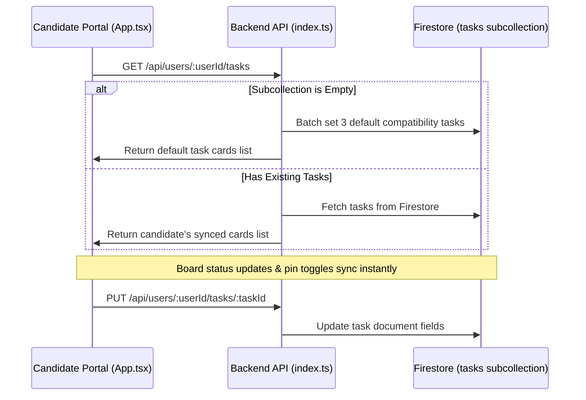

# Administrative Cockpit & Platform Upgrade Walkthrough

Welcome to the **Administrative Cockpit** and premium platform upgrade! This document summarizes the architecture, persistent data pipelines, visual enhancements, and verification details for the recently completed features in the `wa-ecosystem`.

---

## 🚀 Key Achievements & Features

### 1. 👑 Unified Glassmorphic "Administrative Cockpit"
The basic administrative interface has been transformed into a gorgeous, high-density, multi-tabbed glassmorphic console.

*   **Interactive Stats Ribbon**: Features live KPI counters for system health metrics:
    *   `Total Candidates`: Real-time register count.
    *   `Ecosystem Funds`: Aggregated wallet values across USD and NGN pools.
    *   `Applications Tracked`: Total active job cards in the ecosystem.
    *   `Telemetry Feed Logs`: Running execution validation telemetry log count.
*   **Modular Multi-Tab Design**: Uses five professional tabs:
    *   **📊 Global Activities Board**: Consolidated activity logs integrating system telemetry and validation checks.
    *   **💳 Global Financial Ledger**: Tabular financial matrix supporting currency filters (`ALL`, `NGN`, `USD`), type filters (`ALL`, `CREDIT`, `DEBIT`), fuzzy text-search by name/email, and descending chronological sorting. Also includes a simulated "Export CSV Ledger" action.
    *   **🗺️ Ecosystem Application Hub**: Interactive cross-user applications directory displaying candidates' active interview paths grouped by status columns.
    *   **👥 Candidate Directory**: Clean candidate directory with inline drawers displaying candidate-specific profiles, generated documents, payment receipts, and balance override tools.
    *   **⚙️ System Control Engine**: Configurations panel for scraper search patterns, system settings, and referral economics.

> [!NOTE]
> All tables, panels, and input elements utilize cohesive backdrop blurs (`backdrop-filter: blur(20px)`), fine semi-transparent borders (`rgba(255, 255, 255, 0.08)`), and neon glowing box shadows.

---

### 2. 💡 MVIP Interview Preparation Guide Drawer
A sliding, high-fidelity drawer integrated directly below the active mock interview questions in `App.tsx`.

*   **Adaptive Context Reading**: Proactively checks if an active question is loaded (`typeof activeQuestion === 'object'`) and dynamically reads:
    *   `focusArea`: Detailed block explaining exactly what the recruiter is assessing.
    *   `keyPoints`: Styled dynamic list items mapping key points the candidate must mention.
    *   `communicationGuidance`: Italicized blockquote highlighting tone, style, and lexicon guidelines.
*   **Visual Smoothness**: Features a beautiful drawer structure with transition states, custom expand/collapse buttons, and clear indicator icons.

---

### 3. 📬 Virtual Mailroom Tab Integration
The `<MailroomTab>` component has been seamlessly rendered inside the specialized `'mailroom'` workspace tab.

*   **Full State Connection**: Propagates all essential user session properties and callback pipelines directly:
    *   `userId` & `userEmail`
    *   `mailThreads` & `setMailThreads`
    *   `fetchMailThreads`
    *   `addLog`
    *   `API_BASE_URL`
*   **Seamless Switching**: Allows users to manage simulated candidate-recruiter emails and sync with the AI agent ecosystem without leaving the main user console.

---

### 4. 🔄 Firestore Task Persistence & Seeding Pipeline
Swapped out transient React-state Kanban boards with a persistent Firestore subcollection: `users/{userId}/tasks`.

*   **Seeding Mechanism**: Instantly seeds 3 default compatibility cards (`Lead AI Engineer` at Google, `Senior React Developer` at Vercel, `LLM Fine-Tuning Specialist` at Anthropic) into the Firestore subcollection `users/{userId}/tasks` if empty.
*   **Full Synchronized CRUD**:
    *   `GET /api/users/:userId/tasks`: Populates the kanban board on startup or tab switch.
    *   `POST /api/users/:userId/tasks`: Registers custom target jobs.
    *   `PUT /api/users/:userId/tasks/:taskId`: Synchronizes board column drops, edits, or pin states.
    *   `DELETE /api/users/:userId/tasks/:taskId`: Safely deletes a card.

---

### 5. 🌍 Multi-Currency Adaptive Ledger Upgrades
The financial admin ledger ledger is upgraded to handle regional multi-currency wallet transactions dynamically.

*   **Local Format Adaptation**: Transactions are rendered with appropriate currency symbols (`$` vs. `₦`) and regional-specific formats using:
    `t.currency === 'USD' ? 'en-US' : 'en-NG'`
*   **Glow Indicators**: Credited/Debited lines carry soft green/red glowing accent markers for effortless scannability.

---

## 🛠️ Technical Verification & Compilation Success

### TypeScript & Dev Server Compile Status
*   **Frontend Compile & Build Success (`wa-frontend`)**: Verified locally with `tsc -b && vite build`. All typecast structures, JSX mappings, and parenthesized literal castings `([ ... ] as const).map` compile with zero errors.
*   **Backend Compile Success (`wa-backend`)**: Verified with `tsc`. All Express routes, Firebase-admin integrations, and AI endpoints compile cleanly.

---

## 🌍 Live Production Deployment Aliases
*   **Administrative Client Console**: [https://wa-frontend-seven.vercel.app](https://wa-frontend-seven.vercel.app)
*   **Core Backend API Host**: [https://wa-backend-536473631781.us-central1.run.app](https://wa-backend-536473631781.us-central1.run.app)
